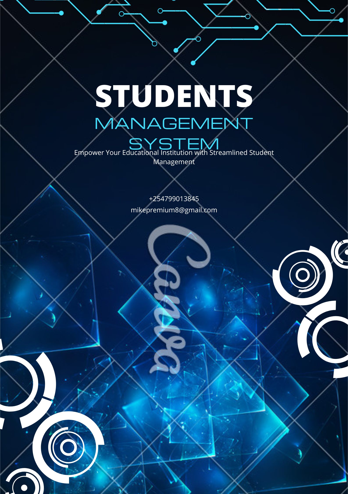

STUDENTS MANAGEMENT SYSTEM WRITTEN IN C LANGUAGE

This is a simple library management system that am working on. 

1. STUDENT ADMISSION 
   a) The following are the required information during the admission process;
   -regNo (autogenerated)
   -Name 
   -Date of birth
   -Nationality
   -Address
   -Phone number

   b)the functions will include;
   *registering student details
   *editing student details
   *deleting student details
   *viewing student details
   
2. HOSTELS 
   For hostels, the functions will include;
   -Hostel registration
   -View registered hostels
   -Allocate hostels 
   -View allocated hostels 
   -vacate hostel 
   -View vacated hostels 

3. Examination 
4. library management system 
5. course application

STUDENT MANAGEMENT SYSTEM

Choose one of the following.

1. Student Management
2. Hostel Management
3. Course Application
4. Library Managenent
5. Exit
Enter your option: 1

STUDENT MANAGEMENT
1. Register new student
2. Search Student
3. Delete student record
4. View student details
5. Edit student details
6. Check student count
7. Back to main menu
Enter an option: 1

NEW STUDENT REGISTRATION
1. Male student registration
2. Female student registration
3. Back to main menu
Enter an option: 1
---------------------------------------------
Enter your Name: Michael Odhiambo
Enter your DOB: 2020
Enter your nationality: kenyan
Enter your address: Umoja Innercore
Enter your mobile phone number: 99078745 

Confirm the entered details
-------------------------------------
Registration number: 5
Name: Michael Odhiambo
Date of birth: 2020
Nationality: kenyan
Address: Umoja Innercore
Phone number: 99078745
-------------------------------------
Do you want to continue?
1. Yes
2. No
Enter an option: 1

Details captured successfully!
Your registration number is 5
---------------------------------------------

Choose one of the following.

1. Student Management
2. Hostel Management
3. Course Application
4. Library Managenent
5. Exit
Enter your option: 1

STUDENT MANAGEMENT
1. Register new student
2. Search Student
3. Delete student record
4. View student details
5. Edit student details
6. Check student count
7. Back to main menu
Enter an option: 1

NEW STUDENT REGISTRATION
1. Male student registration
2. Female student registration
3. Back to main menu
Enter an option: 2
---------------------------------------------
Enter your Name: 
Ann James
Enter your DOB: 2001
Enter your nationality: kenyan 
Enter your address: Kayole
Enter your mobile phone number: 998764335

Confirm the entered details
-------------------------------------
Registration number: 6
Name: Ann James
Date of birth: 2001
Nationality: kenyan
Address: Kayole
Phone number: 998764335
-------------------------------------
Do you want to continue?
1. Yes
2. No
Enter an option: 1

Details captured successfully!
Your registration number is 6
---------------------------------------------

Choose one of the following.

1. Student Management
2. Hostel Management
3. Course Application
4. Library Managenent
5. Exit
Enter your option: 2

HOSTEL MANAGEMENT

1. Register new hostel
2. View hostels
3. Allocate hostel
4. View allocated students
5. View allocated hostels
6. Vacate hostel
7. Edit hostel details
8. Delete hostel detail
9. Back to main menu
Enter an option: 3

HOSTEL ALLOCATION
1. Allocate male hostel
2. Allocate female hostel
3. Back to main menu
Enter an option: 1
---------------------------------------------
Enter student registration number: 1
Student with ID 1 not found
---------------------------------------------

Choose one of the following.

1. Student Management
2. Hostel Management
3. Course Application
4. Library Managenent
5. Exit
Enter your option: 2

HOSTEL MANAGEMENT

1. Register new hostel
2. View hostels
3. Allocate hostel
4. View allocated students
5. View allocated hostels
6. Vacate hostel
7. Edit hostel details
8. Delete hostel detail
9. Back to main menu
Enter an option: 1

REGISTER HOSTELS
1. Register male Hostel
2. Register female Hostel
3. Back to main menu
Enter an option: 1

Male hostel registration
---------------------------------------------
The new hostel number is: 7
Enter hostel name: Obote
Hostel registered successfully!
---------------------------------------------

Choose one of the following.

1. Student Management
2. Hostel Management
3. Course Application
4. Library Managenent
5. Exit
Enter your option: 2

HOSTEL MANAGEMENT

1. Register new hostel
2. View hostels
3. Allocate hostel
4. View allocated students
5. View allocated hostels
6. Vacate hostel
7. Edit hostel details
8. Delete hostel detail
9. Back to main menu
Enter an option: 3

HOSTEL ALLOCATION
1. Allocate male hostel
2. Allocate female hostel
3. Back to main menu
Enter an option: 1
---------------------------------------------
Enter student registration number: 102
Enter room number: 7
Room allocated successfully
---------------------------------------------

Choose one of the following.

1. Student Management
2. Hostel Management
3. Course Application
4. Library Managenent
5. Exit
Enter your option: 2

HOSTEL MANAGEMENT

1. Register new hostel
2. View hostels
3. Allocate hostel
4. View allocated students
5. View allocated hostels
6. Vacate hostel
7. Edit hostel details
8. Delete hostel detail
9. Back to main menu
Enter an option: 4

VIEW ALLOCATED STUDENTS
1. View allocated male students
2. View allocated female students
3. Back to main menu
Enter an option: 1
---------------------------------------------
Student name:  Michael Johnson
Student regNo: 102
Hostel room number: 7
Hostel name: Obote,

---------------------------------------------

Choose one of the following.

1. Student Management
2. Hostel Management
3. Course Application
4. Library Managenent
5. Exit
Enter your option: 4

LIBRARY MANAGEMENT

1. Register new book
2. View registered books
3. Borrow a book
4. View borrowed books
5. Return a book
6. Search a book
7. Delete book record
8. Update book record
9. Back to main menu
Enter your choice: 1
----------------------------------
Enter book title: STUDENTS MANAGEMENT SYSTEM
Enter book author: Michael Odhiambo
Enter book ISBN: 240
Enter number of units: 20

Confirm the book details
--------------------------
ISBN: 240
Title: STUDENTS MANAGEMENT SYSTEM
Author: Michael Odhiambo
Units: 20
Initial Units: 20
--------------------------
1. Yes, proceed
2. No, abort book registration
Enter option: 1

Book registered successfully.
----------------------------------

Choose one of the following.

1. Student Management
2. Hostel Management
3. Course Application
4. Library Managenent
5. Exit
Enter your option: 2

HOSTEL MANAGEMENT

1. Register new hostel
2. View hostels
3. Allocate hostel
4. View allocated students
5. View allocated hostels
6. Vacate hostel
7. Edit hostel details
8. Delete hostel detail
9. Back to main menu
Enter an option: 9

Choose one of the following.

1. Student Management
2. Hostel Management
3. Course Application
4. Library Managenent
5. Exit
Enter your option: 4

LIBRARY MANAGEMENT

1. Register new book
2. View registered books
3. Borrow a book
4. View borrowed books
5. Return a book
6. Search a book
7. Delete book record
8. Update book record
9. Back to main menu
Enter your choice: 2
----------------------------------
Registered Books:
-----------------
ISBN: 2
Title: miike
Author: kiks
Units: 2
-----------------
ISBN: 1
Title: Student management system
Author: Michael Odhiambo
Units: 12
-----------------
ISBN: 240
Title: STUDENTS MANAGEMENT SYSTEM
Author: Michael Odhiambo
Units: 20
-----------------
----------------------------------

Choose one of the following.

1. Student Management
2. Hostel Management
3. Course Application
4. Library Managenent
5. Exit
Enter your option: 5
Are you sure you want to exit?
1. Yes
2. No
Enter an option: 1
Thank you for using our services. Exiting...
